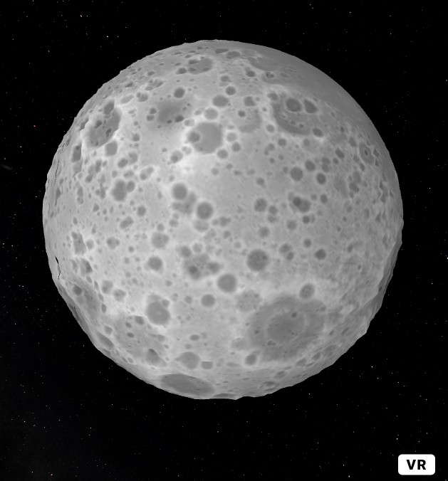

## Moon with displacement map

You can test it live here: 
https://supertobi.github.io/aframe-moon-with-displacement-map/

Moon Image and displacement map are from NASA:

[https://svs.gsfc.nasa.gov/4720](https://svs.gsfc.nasa.gov/4720)

Background Stars v2 from the Charles Hayden Planetarium – Museum of Science, Boston:

[https://thefulldomeblog.com/2013/11/13/background-stars-v2/](https://thefulldomeblog.com/2013/11/13/background-stars-v2/)
